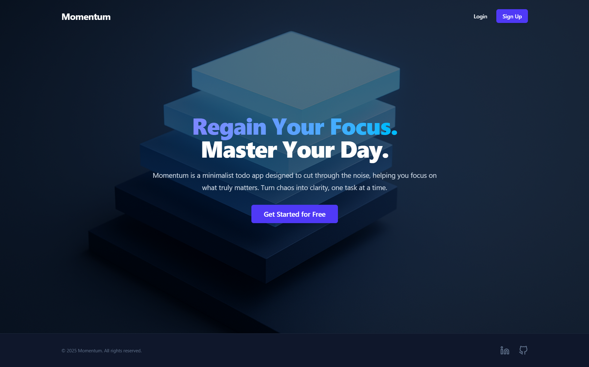
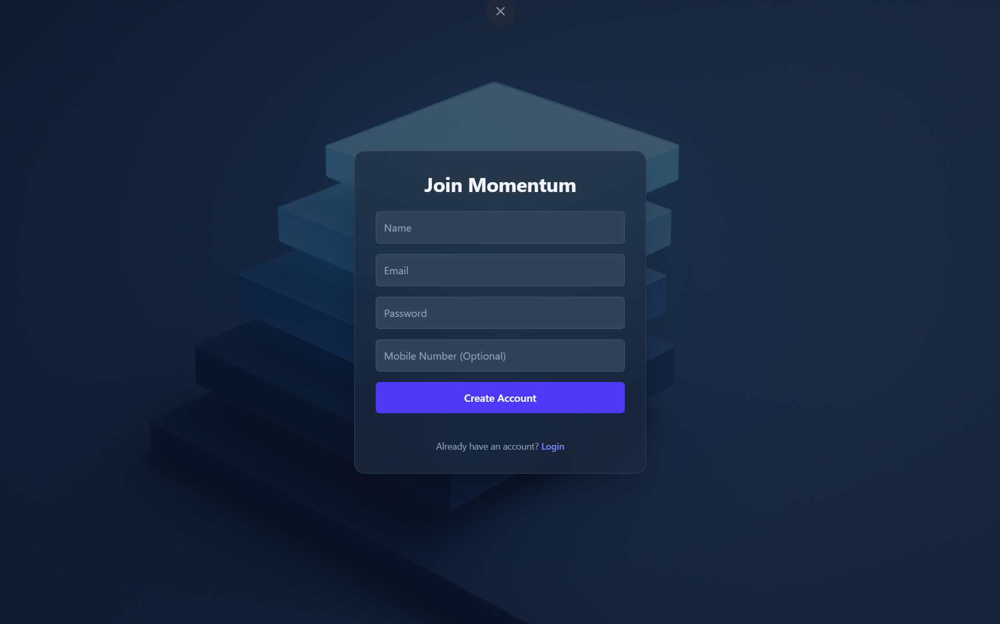
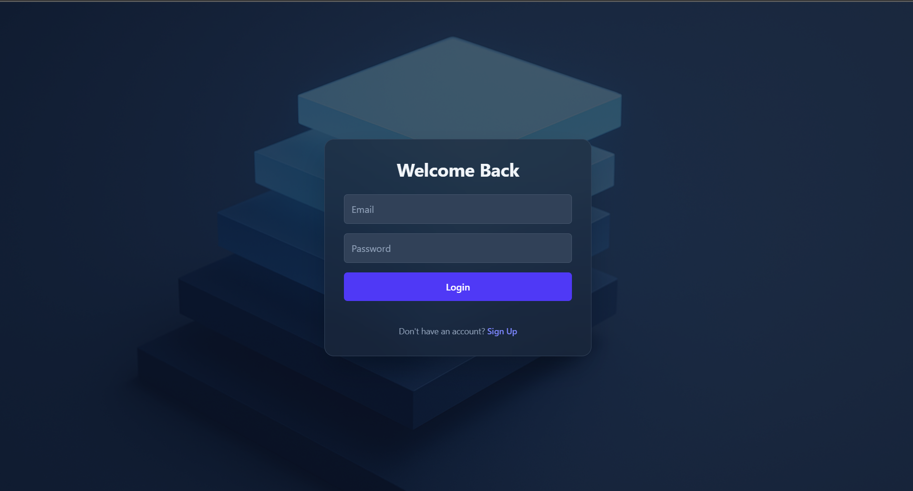
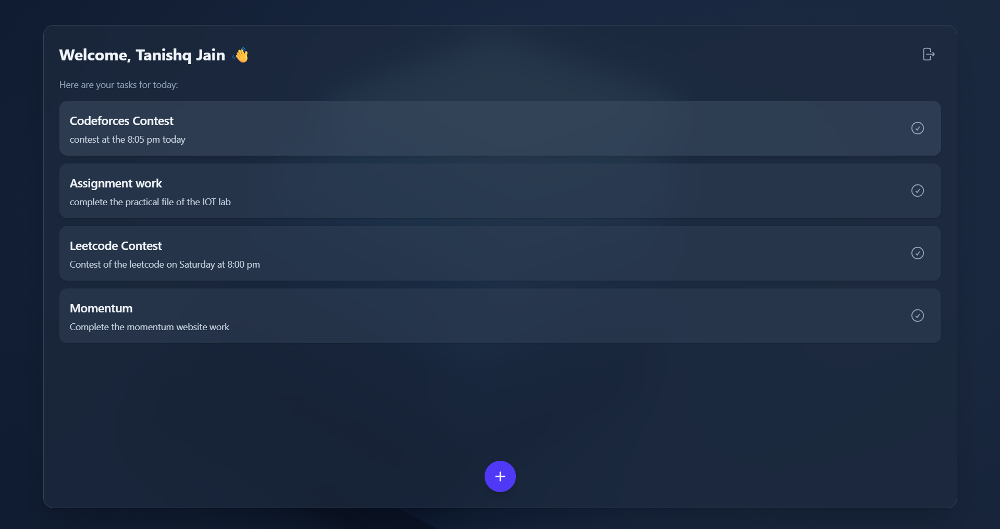

# Momentum - Full-Stack To-Do Dashboard

[](https://reactjs.org/)
[](https://www.typescriptlang.org/)
[](https://tailwindcss.com/)
[](https://expressjs.com/)
[](https://www.mongodb.com/)
[](https://nodejs.org/)

**Momentum** is a modern, full-stack personal dashboard and To-Do application built with the MERN stack and TypeScript. It provides a secure, robust, and beautiful environment to help you stay organized and focused. With a complete user authentication system, your tasks are saved to your personal account, accessible anytime.

## ✨ Sneak Peek

*Landing Page of the Momentum Website*
 

*Sign Up Page of the Momentum Website* 
 

*Login Page of the Momentum Website* 


*Your personal dashboard, where productivity meets elegant design.*



## 🚀 Features

-   **Secure User Authentication:** Complete sign-up and login system with password hashing using **bcrypt** to ensure user data is always protected.
-   **Persistent Sessions with JWT:** Uses JSON Web Tokens (JWT) for session management. You stay logged in across browser sessions for seamless access to your dashboard.
-   **Full-Stack Architecture:** A robust back-end powered by **Node.js** and **Express** handles all business logic and API requests.
-   **Database Integration:** User accounts and to-do lists are stored securely in a **MongoDB** database.
-   **Detailed To-Do Management:** Add tasks with both a **title** and a **description** for better organization.
-   **Intuitive Task Handling:** Easily add, track, and remove tasks as you complete them.
-   **Dynamic & Modern UI:** A sleek front-end built with **React** and styled with **Tailwind CSS** provides a responsive and user-friendly experience.
-   **Efficient API Communication:** The front-end communicates with the back-end API using **Axios** for smooth data fetching and manipulation.

## 💻 Tech Stack

This project is built with a modern, type-safe, and scalable technology stack.

### Frontend
-   **React:** A JavaScript library for building user interfaces.
-   **TypeScript:** For static typing, leading to more robust and maintainable code.
-   **Tailwind CSS:** A utility-first CSS framework for rapid UI development.
-   **Axios:** A promise-based HTTP client for making API requests.

### Backend
-   **Node.js:** A JavaScript runtime environment.
-   **Express.js:** A minimal and flexible Node.js web application framework.
-   **MongoDB:** A NoSQL database for storing user and to-do data.
-   **Mongoose:** An ODM (Object Data Modeling) library for MongoDB and Node.js.
-   **bcrypt:** A library for hashing user passwords.


## 🛠️ How to Set Up and Run Locally

Follow these instructions to get the project up and running on your local machine for development and testing purposes.

### Prerequisites

-   **Node.js** (v14 or later)
-   **npm** or **yarn**
-   **MongoDB:** You must have a MongoDB database running. You can either [install it locally](https://www.mongodb.com/try/download/community) or use a cloud service like [MongoDB Atlas](https://www.mongodb.com/cloud/atlas).

### Installation & Setup

**1. Clone the repository:**
```bash
git clone https://github.com/Tanishq112005/Todo_app.git
cd Todo_app
```

**2. Set up the Backend (Server):**
```bash
# Navigate to the server directory
cd backend

# Install backend dependencies
npm install

# Create a .env file in the /server directory
touch .env
```
Now, open the `.env` file and add the following environment variables. You'll need to provide your own MongoDB connection string and a secret for JWT.

```env
# .env file for the server

#Your Port Number 
Port_number=3001        // any port number according to you  

# Your MongoDB connection URI
Mongo_db=mongodb+srv://<user>:<password>@cluster.mongodb.net/yourDatabaseName?retryWrites=true&w=majority


**3. Set up the Frontend (Client):**
```bash
# Navigate back to the root and into the client directory
cd ../frontend

# Install frontend dependencies
npm install
```

### Running the Application

You can run both the client and server concurrently from the root directory with a single command.

```bash
# From the root directory 

# to run the backend 
cd backend 
cd src
ts-node index.ts 

# to run frontend 
cd frontend 
npm run dev 
```


-   The React frontend will be available at **`http://localhost:3000`**
-   The Express backend will be running on **`http://localhost:5000`** (or your specified port)

## 📬 Contact

This project was created with ❤️ by **Tanishq**. Feel free to reach out with any questions, feedback, or collaboration ideas!

[](https://github.com/Tanishq112005)
[](https://www.linkedin.com/in/tanishq-jain-6b90b1292/)  
[](mailto:tanishqjain1109@gmail.com)  